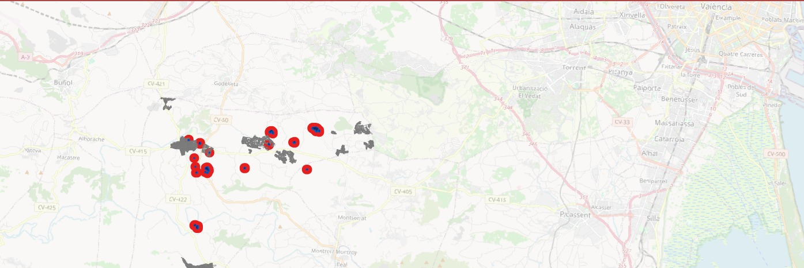

# SARWatch

  

**SARWatch** is an SaaS initiative and prototype platform (official site: https://sarwatch.earth) that leverages **Synthetic Aperture Radar (SAR)** satellite imagery for **near real-time monitoring and analysis of natural disasters**, with an initial focus on floods.  
This repository contains a **reproducible Python pipeline** (rasterio + GeoPandas + GDAL) that turns SAR backscatter into **flood extent**, intersects it with **buildings and road networks**, and exports **actionable KPIs** (e.g., flooded m², km of affected roads, simple € impact).

---

## Overview

Conventional optical satellites are powerful tools for observing Earth's surface but fail under adverse weather conditions such as clouds, smoke, or during night.  
SAR satellites operate **day and night**, **penetrate atmospheric layers**, and are robust to clouds and smoke — exactly when disasters unfold.

**In this repo, SARWatch provides:**
- An automated **flood mask** from Sentinel-1 RTC backscatter (+ optional LIA/incidence filtering).
- **Flood polygons** (GeoPackage) ready for GIS.
- **Intersection with buildings** (example CONSTRU dataset) to compute flooded m² and simple **€ cost** (€/m² fixed or CSV lookup).
- **Intersection with roads** (roads.gpkg, layer `rt_tramo_vial`) to compute **km of roads affected** using a **±4.5 m** buffer around the centreline.
- Outputs in open formats: **GeoTIFF, GeoPackage, GeoJSON, CSV** (ready for QGIS/WMS/API).

---

## Contents
--------

| Section | Description |
| -------- | ------------ |
| [1. Problem Statement](#1-problem-statement) | Challenges with optical satellites during disasters |
| [2. Proposed Solution](#2-proposed-solution) | SAR-based approach for near real-time monitoring |
| [3. Current Limitations](#3-current-limitations) | Data frequency and availability issues |
| [4. Technological Context](#4-technological-context) | Market and LEO ecosystem evolution |
| [5. Applications](#5-applications) | Real-world use cases |
| [6. Platform Architecture](#6-platform-architecture) | Cloud design and data flow |
| [7. Functional Modules](#7-functional-modules) | UI and user roles |
| [8. Data Sources](#8-data-sources) | Integration with open and commercial providers |
| [9. Non-Functional Requirements](#9-non-functional-requirements) | Scalability, security, reliability |
| [10. Future Enhancements](#10-future-enhancements) | Planned improvements |
| [11. What the Code Actually Does](#11-what-the-code-actually-does) | Pipeline & scripts in this repo |
| [12. Inputs & Expected Files](#12-inputs--expected-files) | AOI, S1 RTC, buildings and roads |
| [13. Quickstart (for judges)](#13-quickstart-for-judges) | Run the demo end-to-end |
| [14. KPIs & Outputs](#14-kpis--outputs) | What to look at after running |
| [15. Limitations & Mitigation](#15-limitations--mitigation) | Honest constraints and workarounds |
| [16. Validation Plan](#16-validation-plan) | How we verify results |
| [17. Deployment Modes & Costs](#17-deployment-modes--costs) | Base vs Fast-Track |

---

## 1. Problem Statement

During extreme weather (storms, hurricanes, floods, eruptions), optical satellites often **cannot capture usable imagery** due to clouds or night.  
This delays **situational awareness** in the first **24–72 hours**, precisely when decisions save lives and reduce losses.

---

## 2. Proposed Solution

**SARWatch** provides a **repeatable flood pipeline** that converts Sentinel-1 **RTC** backscatter into a **binary water mask**, polygonizes it, and computes **impact metrics** by crossing with **buildings** and **road network** layers.  
All outputs are exportable in **open formats** and can be **visualized in QGIS** or published as **WMS/WFS/GeoJSON**.

**Key Advantages of SAR**
- **Weather independence:** Works at night and through clouds.  
- **Operational robustness:** Backscatter is resilient to smoke/ash; supports emergency use.  
- **Decision-ready:** Outputs are not just images — they are **metrics** to act on.

---

## 3. Current Limitations

While SAR offers huge advantages, open missions (e.g., Sentinel-1) can have **D+1/D+2 latency** from acquisition to availability.  
Emerging/commercial constellations (e.g., **Capella Space**, **ICEYE**, **Umbra**) reduce latency and revisit dramatically and can be integrated in a **Fast-Track** mode (<6 h, paid).

---

## 4. Technological Context

The LEO landscape is accelerating; many SAR options are available. SARWatch **embraces open data first** (Sentinel-1 + NASA DEMs), with the option to add **commercial SAR** when hours matter.

---

## 5. Applications

| Domain | Use Case |
| ------- | -------- |
| **Emergency Management** | Flood extent mapping and early triage (D0–D2) |
| **Infrastructure Monitoring** | Identify roads/bridges/buildings affected |
| **Municipal Finance** | Preliminary € impact (€/m²) for relief allocation |
| **Civil Society** | Public map with safe corridors and risk zones |

<video width="600" controls>
  <source src="InfrastructuresDamage.mp4" type="video/mp4">
  Your browser does not support the video tag.
</video>

---

## 6. Platform Architecture

> **Note:** The repo implements a local Python pipeline; the table below sketches a typical future **cloud** deployment.

### Cloud Infrastructure (AWS)

| Layer | Services |
|-------|-----------|
| Data Ingestion & Storage | AWS Lambda / Glue, S3, RDS / DynamoDB |
| Processing & AI Analysis | AWS SageMaker, EC2 / Fargate |
| APIs & Frontend | API Gateway + Lambda, CloudFront + S3 |
| Authentication | AWS Cognito |
| Payments | Stripe / AWS Marketplace |

### System Overview
- Interactive map viewer  
- Satellite imagery database  
- Role-based access control  
- AI-powered alerts  
- Premium report and download system  

  

---

## 7. Functional Modules

### 7.1. Home Interface
- Interactive world map with zoom and search  
- Login/Sign-up options  
- Alerts and notifications panel  

### 7.2. User Roles

| Role | Permissions |
|------|--------------|
| **Public Users** | Browse free old maps |
| **Subscription Users** | Monitoring tools and access to reports |
| **Authorities / Governments** | Access premium data, generate reports, receive alerts |

### 7.3. Map & Reports
- Sidebar shows available SAR maps by region  
- Options to download, purchase, or request data  
- Smart Reports combine SAR data with socioeconomic layers  

---

## 8. Data Sources

- **ESA Copernicus**: Sentinel-1 (SAR RTC backscatter & incidence angle/LIA)  
- **NASA DEMs**: SRTM / ASTER for terrain context  
- **OpenStreetMap / National GIS**: roads/buildings if available  
- **Local datasets**: cadastral buildings, municipal roads (`roads.gpkg`, layer `rt_tramo_vial` in the demo)

---

## 9. Non-Functional Requirements

| Requirement | Description |
|--------------|-------------|
| Scalability | Auto-scaling backend (ECS/Fargate) |
| Security | Cognito + IAM roles |
| Data Privacy | GDPR-compliant |
| Performance | Map load < 3s, API < 500ms (target) |
| Localization | Multi-language support (Phase 2) |

---

## 10. Future Enhancements

- Mobile app for citizen reporting and offline access  
- Crowdsourced validation of detected changes  
- Multi-level alert severity (Minor, Moderate, Critical)  
- Integration with official emergency systems  
- Full multilingual support  
- **Coherence-based urban flood detection**, DEM fusion and hydrologic context  
- Optional **Fast-Track** with commercial SAR (<6 h latency)

---

## 11. What the Code Actually Does

This repository implements a **local, reproducible flood pipeline**:

- **`src/process_and_costs.py`**  
  - Reads **AOI** (`data/aoi/zona.geojson`) and **Sentinel-1 RTC** rasters (`data/raw/current_s1_rtc/*.tif`): prefers **VH**, then **VV**; reads **LIA/incidence** if present.  
  - Optional auto conversion to **dB** if input is linear (0–1).  
  - Applies **WATER_THRESHOLD_DB** (default **−20 dB**) and optional **LIA filter** (20°–60°).  
  - Writes **`data/results/water_mask.tif`** (binary 0/1) with metadata tags (source, polarization, acquisition, threshold).  
  - Polygonizes to **`data/results/flood.gpkg`** (layer **`flood`**).  
  - Crosses with **buildings** (`data/dem/raw/_buildings/CONSTRU_sample/CONSTRU.SHP`) to compute flooded m² per building and **€ impact** (€/m² fixed or via CSV lookup).  
  - Exports **`data/results/viviendas_inundacion.gpkg`** (`viviendas_all`, `viviendas_afectadas`) and CSV summaries.

- **`src/04_impact_infra.py`**  
  - Loads **`water_mask.tif`**, builds **flood polygons**, and reads **roads** from **`data/aoi/roads.gpkg`** (layer **`rt_tramo_vial`**).  
  - Buffers road centrelines by **±4.5 m** (operational road corridor) and intersects with flood to compute **km of roads affected**.  
  - Writes **`data/impact/impacto_infra.csv`** with the total affected kilometres.  
  - *(Bridges logic is omitted in the consolidated version; can be added later.)*

- **`src/run_pipeline.py`**  
  - Convenience launcher that runs the above in sequence.

- **`scriptqgis.py`** (optional QGIS loader)  
  - From QGIS Python Console, loads **`water_mask.tif`**, **`flood.gpkg`**, and **`viviendas_inundacion.gpkg`**, applies simple symbology, and creates two helper memory layers for emphasis: **`flood_ring`** (buffered ring) and **`flood_centroids`** (💧 symbol).

---

## 12. Inputs & Expected Files

Place/verify the following before running:

data/aoi/zona.geojson
data/raw/current_s1_rtc/*.tif # e.g., *_VH.tif, *_VV.tif, inc_map.tif
data/dem/raw/_buildings/CONSTRU_sample/CONSTRU.SHP
data/aoi/roads.gpkg # layer: rt_tramo_vial

Outputs to check:
data/results/water_mask.tif — binary flood mask
data/results/flood.gpkg — layer: flood
data/results/viviendas_inundacion.gpkg — layers: viviendas_all, viviendas_afectadas
data/impact/impacto_infra.csv — km of roads affected (±4.5 m buffer around centreline)
Optional (QGIS): run scriptqgis.py from the QGIS Python Console to load layers with styling.

## 14. KPIs & Outputs

Flooded area (m²) — total and per building
Number of affected buildings
Estimated economic impact — €/m² (fixed or CSV lookup)
Km of roads affected — ±4.5 m buffer around road centreline
QA samples — 500 m grid of backscatter samples (for quick sanity checks)
All key products include timestamps and tags for traceability.

## 15. Limitations & Mitigation

Vegetation / wetlands false positives: use DEM/slope masks and multi-temporal checks.
Urban layover/shadow: LIA filtering helps; coherence (future work) improves urban reliability.
Tidal / river stage variability: prefer temporal baselines; include hydrologic context.
Latency (open data): disclose acquisition/processing times; use Fast-Track with commercial SAR when minutes matter.

## 16. Validation Plan

Compare against Copernicus EMS products whenever available.
Field validation via partners (photos/GPS).
Metrics: IoU and precision/recall for flood extent; % overlap of affected roads vs. ground truth.

## 17. Deployment Modes & Costs

Base (Open Data): Sentinel-1 + NASA DEMs; low cost; typical availability D+1 / D+2.
Fast-Track (Commercial SAR): tasking on demand, < 6 h latency (paid) for urgent operations.
Delivery formats: GeoTIFF, GeoPackage, GeoJSON, CSV, WMS/WFS.

Acknowledgments
Claude → used for web page creation
Ai.invideo.io → Video generation
Google Cloud Text-to-Speech → Audio generation
ChatGPT → consulting tool
Open data: ESA Sentinel-1, NASA DEMs
Libraries: rasterio, GeoPandas, shapely, GDAL/PROJ, QGIS

